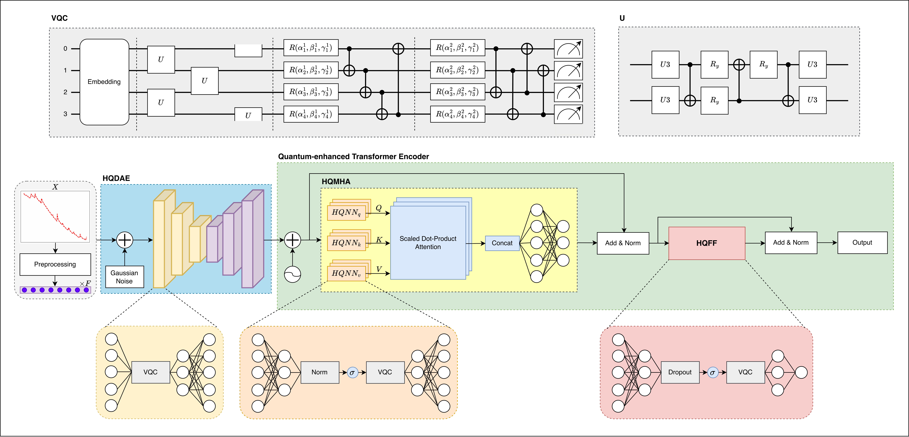
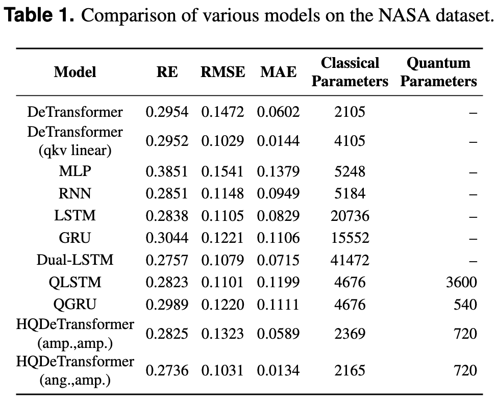
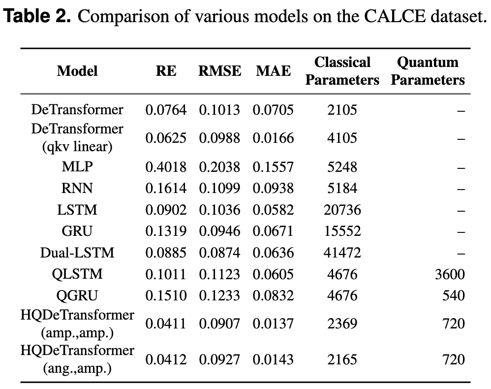

# HQDeTransformer: Hybrid Quantum Denoising Transformer for Time Series Forecasting

## HQDeTransformer: Hybrid Quantum Denoising Transformer for Time Series Forecasting

Kyeong-Hwan Moon1,†, Seon-Geun Jeong2,†, and Won-Joo Hwang1,2,*  
† Equal contribution.

**Abstract**: Accurate prediction of the remaining useful life (RUL) of lithium-ion batteries is critical for enhancing the reliability and safety of battery-powered systems, especially in electric vehicles. While recent machine learning approaches such as Transformers and recurrent neural networks have shown promising results, their deployment in resource-constrained environments is limited due to high computational costs and large model sizes. In this paper, we propose a novel hybrid quantum-classical denoising Transformer (HQDeTransformer) architecture that integrates variational quantum circuits (VQCs) and quantum-enhanced attention mechanisms into a Transformer-based framework. The proposed HQDeTransformer employs a hybrid quantum denoising autoencoder to mitigate noise in capacity degradation sequences and utilizes hybrid quantum-classical neural networks to construct lightweight multi-head attention and feedforward blocks. Experimental evaluations on the NASA and CALCE benchmark datasets demonstrate that HQDeTransformer achieves superior performance compared to conventional machine learning models and quantum machine learning models, while reducing the number of trainable parameters. Furthermore, the use of angle-amplitude quantum embeddings and deeper quantum layers contributes to enhanced generalization and expressivity. These results highlight the potential of hybrid quantum-classical models for lightweight, accurate, and noise-resilient RUL prediction in practical battery management systems.

## Results

  

  

## Datasets

Datasets can be accessed through the following public links or by searching the corresponding websites.

- **NASA**: https://data.nasa.gov/dataset/li-ion-battery-aging-datasets
- **CALCE**: https://calce.umd.edu/battery-data
